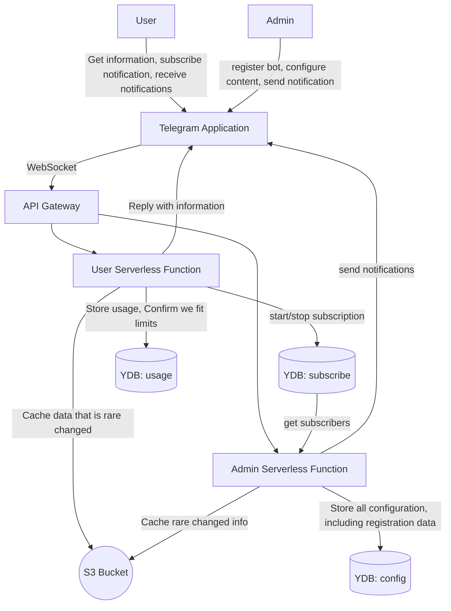

# Системный дизайн: [Конструктор Telegram ботов]

## 1. Задача
Есть потребность в разработке конструктора чат бота в телеграмм. Нужно разработать Архитектуру с минимальной стоимостью. Фокус на удобстве и надёжности. Администраторы ботов должны легко всё создавать и настраивать, а их пользователи должны достаточно быстро всё получать. Как Архитектору необходимо разработать схему такого конструктора.

---

## 2. Функциональные требования
- Регистрация бота. Должна быть максимально простой для Админа
- Создание кнопок должно происходить бистрои понятно
- Текста по нажатию на кнопки будет много. 4096 символов UTF-32
- 1 Пользователь может иметь более 1 бота
- У бота может быть несколько Администраторов
- Любой Админ может отправить уведомления всем подписавшимся в боте
- Нужна статистика и лимиты использования

---

## 3. Нефункциональные требования (Бета)
1. **Производительность**
   - Время ответа 99.99 не более 3х секунд, 99% не более 0.3сек
   - 100 rps в пике

2. **Масштабируемость**
   - Будут файлы. Их хранение нужно будет обеспечить бесконечно (детали есть в расчётах)
   - Размер файлов до 10Мб - это в основном документы Word

3. **Надежность**
   - После обновления данных Админом Пользователи должны увидеть обновления не более, чем через 60 секунд
   - Отправление уведомлений Admin -> User на 100'000 человек должно быть с максимальной вероятностью доставки

4. **Безопасность**
   - Хранение ПД не будет на этапе Беты, так как мы будем оперировать только tg-id, bot-name, что не попадает под 152-ФЗ

---

## 4. Расчёты Хранение Данных
### 4.1 Хранение данных
#### 4.1.1 Боты и кнопки
- 10 кнопок на 1 бота
- 1'000 ботов в бете, 1'000'000 в Проде

#### 4.1.2 Текст
- 1 текст в медиане - это 1024 символа UTF-32
- Под текст: 10 * 1024 * 4б * 1'000'000 = 1'000'000 * 40Кб = 40Гб

#### 4.1.3 Файлы
- 1 Файл в среднем 3Мб. 3 файла на 1 бота.
- Под файлы: 100'000 * 3Мб * 3 = 900 Гб

#### 4.1.4 Всего
- Хватит 1Тб = 40Гб Текст + 900Гб Файлы

# 5. Выбор Архитектурного стиля и его обоснование
1. На этапе Альфы - это набор Serverless functions, разделённых на 2 части:
   1. Admin - CrUD операции, отправка уведомлений
   2. User - cRud операции, подписка/отписка от уведомлений
   3. Будет использоваться CQRS, так как изменения будут происходить на 1-2-3 порядка реже чтения
   4. Будет использоваться DDD для облегчения выделения функциональных блоков в отдельные микросервисы в будущем
2. На этапе Бэты
   1. Смена Serverless на микросервисы
   2. Внедрение кеша

---

## 6. Блок-схема архитектуры

### 5.1 Комметарии к схеме
1. Разделение на Read DB (S3) для Пользователя и YDB для Админа делает фокус на Availability из CAP Theorem и поэтому время ответа будет минимальным. В идеале переделать на взрослый кеш, но это пока дороже и на этапе Беты избыточно
2. Так как мы используем Serverless, то время ответа будет минимальным, даже, если нагрузка резко прыгнет. С другой стороны придётся за это заплатить.
3. DDD, применённый на этом этапе позволит легко выделять отдельные части функциональности в отдельные сервисы 